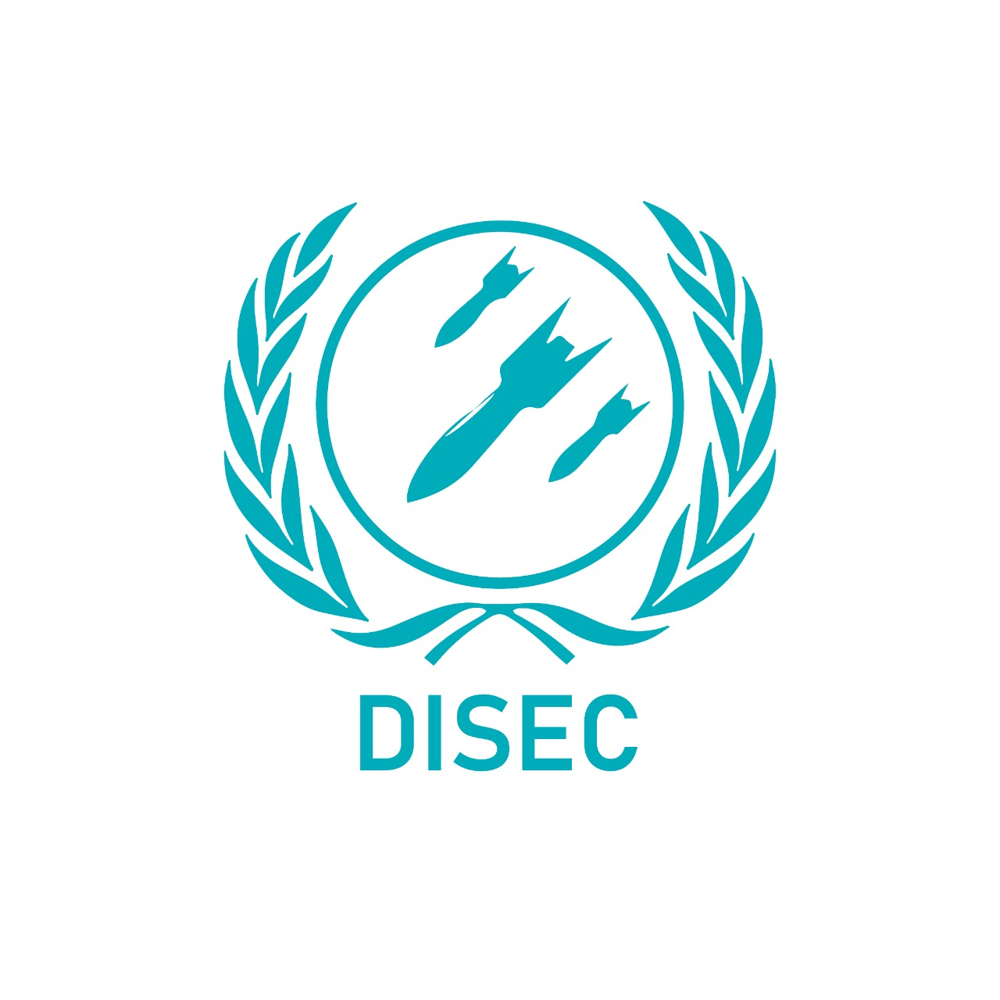
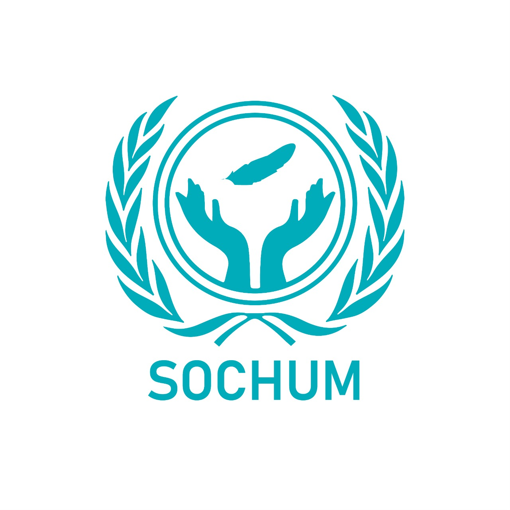
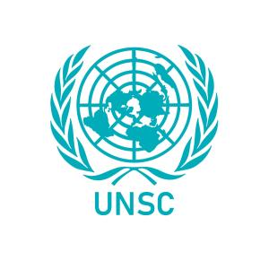

<doctype!>
    <html>

    <head>
        <meta charset="UTF-8">
        <title>PT-MUN 22</title>
        <meta name="viewport" content="width=device-width, initial-scale=1">
        <meta name="description" content="Pak-Turk Maarif Mun 2022">
        <link rel="stylesheet" href="style.css">

        <link rel="stylesheet" href="http://maxcdn.bootstrapcdn.com/font-awesome/4.2.0/css/font-awesome.min.css">

        <link href="http://fonts.googleapis.com/css?family=Cookie" rel="stylesheet" type="text/css">
        
    </head>

    

        

            

            <ul>
                <li><a href="#">Home</a></li>
                <li><a href="#About">About</a></li>
                <li><a href="#commetties1">Study Guides</a></li>
                <li><a href="https://forms.gle/SE75AnHtxGKRQxvt7">Register</a></li>
            </ul>
        

    

    

        
        

            <h1 style="max-width: 100%; max-height: 50%;">
                
Pak-Turk Maarif MUN

            </h1>
            

                
Dates: Feb 19th | Feb 20th 
 
                
Venue: Pak-Turk Maarif Main Boys Campus, Lahore

            

        

    

      
    <h1 id="About" style="font-family: Tahoma,Geneva,sans-serif;">
        <a style="font-size: 6vmin; color: black;">
            
ABOUT US

        </a>
    </h1>
    
    

        The latest edition of Pak-Turk Maarif Model United Nations, PTMUN'22, promises to present a delicious feast of fiery debates served with a side of fervent diplomacy. PTMUN offers you a chance to prove your debating skills as delegates participate in various
        committees. The long awaited MUN will host committees of UNSC, SOCHUM, PNA, UNWOMEN and DISEC. This event is your perfect chance to compete in knowledge packed debates and to prove yourself.
    

      
    

        
    
    
Let Diplomacy Prevail!

        
    

        
    
    <h1 id="commetties1" style="font-family: Tahoma,Geneva,sans-serif;">
        <a style="font-size: 6vmin; color: black; ">
            
COMMITTEES

        </a>
    </h1>
       
    
    
    <h1 style="margin-left: 28%; font-size: 4vmin;">PNA</h1>
    

        Topics and study guides will be released soon

    
<button class="button2" style="background-color: rgb(176, 209, 218); border-radius: 5px; font-size: 3vmin; border-color: rgb(176, 209, 218)" type="button" onclick="alert('')">Download</button>

          
    
    <h1 style="margin-left: 28%; font-size: 4vmin;">DISEC</h1>
    

        Topics and study guides will be released soon

    
<button class="button2" style="background-color: rgb(176, 209, 218); border-radius: 5px; font-size: 3vmin; border-color: rgb(176, 209, 218)" type="button" onclick="alert('')">Download</button>

          
    
    <h1 style="margin-left: 28%; font-size: 4vmin;">SOCHUM</h1>
    

        Topics and study guides will be released soon

    
<button class="button2" style="background-color: rgb(176, 209, 218); border-radius: 5px; font-size: 3vmin; border-color: rgb(176, 209, 218)" type="button" onclick="alert('')">Download</button>

          
    
    <h1 style="margin-left: 28%; font-size: 4vmin;">UNWOMEN</h1>
    

        Topics and study guides will be released soon

    
<button class="button2" style="background-color: rgb(176, 209, 218); border-radius: 5px; font-size: 3vmin; border-color: rgb(176, 209, 218)" type="button" onclick="alert('')">Download</button>

          
    
    <h1 style="margin-left: 28%; font-size: 4vmin;">UNSC</h1>
    

        Topics and study guides will be released soon

    
<button class="button2" style="background-color: rgb(176, 209, 218); border-radius: 5px; font-size: 3vmin; border-color: rgb(176, 209, 218)" type="button" onclick="alert('')">Download</button>

         
    

       
    <h1 style="font-size: 5vmin;">
        
Delegate Guidebook

    </h1>
     
    

        

    

     
    

        

            <a class="button1" style="background-color: rgb(176, 209, 218); border-radius: 5px; font-size: 4vmin; border-color: rgb(176, 209, 218)" type="button" href="delegate guidebook/Delegate Guidebook.pdf">Download</a>
        

    

        
    

        
    <!--

        OUR EXECUTIVE COUNCIL
        

            

                
                

                    <h1>Umer Irfan</h1>
                

            

            

                
                

                    <h1>Umer Irfan</h1>
                

            

            

                
                

                    <h1>Umer Irfan</h1>
                

            

            

                
                

                    <h1>Umer Irfan</h1>
                

            

            

                
                

                    <h1>Umer Irfan</h1>
                

            

        

    

    -->
     
    
    <table style=" width:100%; border-radius: 3px;">
        <tr>
            <th>
                
                

            </th>
        </tr>
        <tr>
            <th>
                
Register via our Google form link

            </th>
        </tr>
        <tr>
            <th>
                
<button class="button1" style="background-color: rgb(176, 209, 218); border-radius: 5px; font-size: 4vmin; border-color: rgb(176, 209, 218);" type="button" onclick="window.location.replace('https://forms.gle/SE75AnHtxGKRQxvt7');">Register Here</button>

            </th>
        </tr>
    </table>
         
    

         
    <footer class="footer-distributed">

        

            
            <!--<h3 class="title">&nbsp;&nbsp;Pak-Turk &nbsp;Maarif</h3>-->

            

                <a href="#">&nbsp;&nbsp;Home</a>
                <a href="#About">&nbsp;&nbsp;About</a>
                <a href="#commetties1">&nbsp;&nbsp;Study Guides</a>
                <a href="https://forms.gle/SE75AnHtxGKRQxvt7">&nbsp;&nbsp;Register</a>
            

        

        

            

                <i class="fa fa-map-marker" style="margin-right: 100%; margin-bottom: -5.5%;"></i>
                
Pak-Turk Maarif Main Boys Campus, Lahore

            

             
            

                <i class="fa fa-phone" style="margin-right: 100%; margin-bottom: -5.5%;"></i>
                
+92 337 7290081 / +92 335 0405036&nbsp;&nbsp;&nbsp;&nbsp;&nbsp;&nbsp;&nbsp;&nbsp;&nbsp;&nbsp;&nbsp;&nbsp;

            

             
            

                <i class="fa fa-envelope" style="margin-right: 100%; margin-bottom: -5.5%;"></i>
                
<a style="font-size: 2.5vmin; margin-left: 9vmin; text-align: left;" href="mailto: ptmun22@gmail.com">ptmun22@gmail.com&nbsp;&nbsp;&nbsp;&nbsp;&nbsp;&nbsp;&nbsp;&nbsp;&nbsp;&nbsp;&nbsp;&nbsp;&nbsp;&nbsp;&nbsp;&nbsp;&nbsp;&nbsp;&nbsp;&nbsp;&nbsp;&nbsp;&nbsp;&nbsp;&nbsp;&nbsp;&nbsp;&nbsp;&nbsp;&nbsp;&nbsp;&nbsp;&nbsp;&nbsp;</a>

            

        

        

            

                 
                &nbsp;&nbsp;Let Diplomacy Prevail!
                

                    <a href="https://www.facebook.com/pakturkmaariflahoremaincampus/"><i class="fa fa-facebook"></i></a>
                    <a href="https://twitter.com/PakTurkMaarif/status/1219887463428231173"><i class="fa fa-twitter"></i></a>
                    <a href="https://www.instagram.com/pakturkmaarif/?hl=en"><i class="fa fa-instagram"></i></a>
                    <a href="https://pk.linkedin.com/company/pakturkmaarif"><i class="fa fa-linkedin"></i></a>
                    <a href="https://www.youtube.com/channel/UCDjHS1Bk-9xMyODPverKVpA"><i class="fa fa-youtube"></i></a>
                

        

        

            
Copyright Ahmad Masoud ©2022 POWERED BY Pak-Turk Maarif

        

    </footer>
    
    
    
    
    </body>

    </html>
</doctype!>
